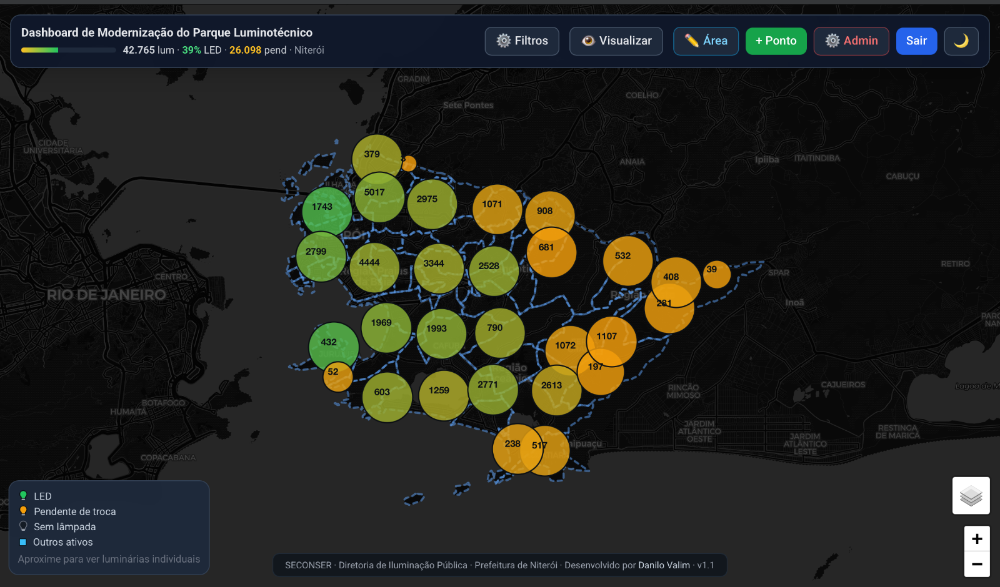
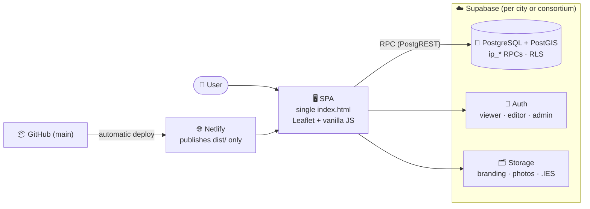

<div align="center">

**[🇧🇷 Português](README.md)** · **🇬🇧 English**

# 💡 OpenLux

### Open platform for public lighting asset management

**A living, georeferenced, versioned inventory of the lighting park — for any
city.** Public map, field data entry, installation photometry, spatial analysis
and full auditing. MIT-licensed code; the data belongs to each municipality.

*Nascido em Niterói, Brasil — feito para qualquer cidade.*

<br/>

[](https://app.netlify.com/projects/iluminacao-niteroi)
[](https://github.com/DaniloSFValim/openlux/actions/workflows/e2e-tests.yml)
[](https://github.com/DaniloSFValim/openlux/actions/workflows/api-testing.yml)
[](https://github.com/DaniloSFValim/openlux/actions/workflows/lighthouse-ci.yml)
[](https://github.com/DaniloSFValim/openlux/actions/workflows/security-scan.yml)


[](https://doi.org/10.5281/zenodo.21305310)
[](LICENSE)
[](https://www.conventionalcommits.org)
[](CONTRIBUTING.md)

<br/>

**[🌍 Project vision](VISION.md)** ·
**[🌐 Live demo (Niterói)](https://iluminacao-niteroi.netlify.app)** ·
**[🏙️ Deploy in your city](docs/DEPLOY_YOUR_CITY.md)** ·
**[🐛 Report a bug](https://github.com/DaniloSFValim/openlux/issues/new?template=bug.md)**

<br/>
<br/>

[](https://iluminacao-niteroi.netlify.app)

*The reference deployment, live: Niterói's park clusters colored by LED modernization rate — click to open.*

</div>

---

## 🌍 The platform

Nearly every city manages its public lighting with spreadsheets, expensive
proprietary systems and **dead data** — a census that starts aging the day after
it's done. OpenLux proposes a different paradigm, detailed in the
**[vision document](VISION.md)** *(Portuguese)*:

- **Living, versioned data** — successive survey campaigns; every point knows the
  age and provenance of its data; nothing is deleted, everything is a layer.
- **Installation, not just inventory** — photometric indices (floor utilization,
  light pollution) computed from cheap attributes collected in the field.
- **Open and expandable** — a city is configuration, not code: multi-tenant
  regional consortia or sovereign instances, with indicator federation on the horizon.

## 🧪 Niterói — reference deployment

The platform is the generalization of a system **in production** in Niterói, RJ,
Brazil (SECONSER · Public Lighting Directorate), which serves as its **living
lab**: every feature is validated with real data and real crews before becoming
platform. The milestone is frozen and citable at DOI
[10.5281/zenodo.21305310](https://doi.org/10.5281/zenodo.21305310).

<div align="center">

| 🔦 Mapped points | 🏘️ Neighborhoods | ✅ LED retrofitted | ⚡ Installed power | 📋 History |
|:---:|:---:|:---:|:---:|:---:|
| **42,765** | **52** | **39%** | **~5.8 MW** | **85,000+ records** |

</div>

Other deployments: see the **[city registry](cities/README.md)**.

## ✨ Features

<table>
<tr>
<td width="50%" valign="top">

### 🗺️ Smart Map
- Zoom-dependent clustering (geohash grid)
- 4 basemaps (dark, light, streets, satellite)
- Neighborhood choropleth and density grid
- 🔥 **Heat maps**: LED %, density and age
- ✏️ **Area selection** (polygon): count, density, LED % and export for just that region (PostGIS)

</td>
<td width="50%" valign="top">

### 🎯 Advanced Filters
- Neighborhood, lamp type, power, status
- LED % and wattage ranges (min/max)
- 📅 Timeline by modernization period
- Point health (green/yellow/red)

</td>
</tr>
<tr>
<td width="50%" valign="top">

### ✏️ Field Management
- Register assets directly on the map
- Luminaires, poles, control boxes, relays, arms
- Editing with optional approval queue
- 📸 Photo upload with automatic compression

</td>
<td width="50%" valign="top">

### 📊 Data & Compliance
- CSV, GeoJSON and PDF export
- Model catalog with **Tier 2 photometry** (lumens, lm/W, PF, THD, IK, SPD, .IES file)
- Full change history per point
- Intervention auditing

</td>
</tr>
</table>

## 🔐 Access Roles

| Role | View | Create/Edit points | Delete | Administration |
|-------|:---:|:---:|:---:|:---:|
| 👁️ `leitura` (viewer) | ✅ | — | — | — |
| ✏️ `editor` | ✅ | ✅ | — | Models |
| 🛡️ `admin` | ✅ | ✅ | ✅ | Users, branding, approvals |

> The map is **public** (no login). Writing requires authentication + role —
> enforced by RLS and `SECURITY DEFINER` RPCs with role checks in the database,
> never in the client.

## 🏗️ Architecture



**Design decisions:** zero build step, zero framework — one self-contained
`index.html` with CDN dependencies. All permission logic lives in the database
(RLS + RPCs). Simplicity a small city hall can operate and a university can audit.

## 📐 Installation Photometry (Tier 3)

> **From inventory to engineering model.** Beyond recording *what* is installed,
> the platform captures **how** and **where** — turning the registry into a basis
> for lighting analysis and a **citable scientific method**.

Each luminaire can be classified by two installation parameters, collected via
**pre-defined options** (no free text) and converted into indices shown on its panel:

| Parameter | Capture | Feeds |
|---|---|---|
| 📐 **Aiming angle** (0°–120°, from nadir) | pre-classified dropdown | Floor utilization · *uplight* |
| 🧱 **Ground material** (asphalt, concrete, water…) | dropdown with tabulated reflectance ρ | Perceived luminance · sky-reflected light |

From these, three first-order indicators are computed and displayed per point:

<div align="center">

| Indicator | Formula | Meaning |
|---|:---:|---|
| **Floor utilization** | `η = max(0, cos θ)` | share of flux useful on the ground |
| **Light pollution** | `P = (1−η) + ρ·η·0.5` | direct + reflected *skyglow* |
| **Relative luminance** | `L = η·ρ` | what the eye perceives |

</div>

📖 **Full model, formulas, reflectance table and normative references (ABNT NBR
5101, CIE 144/150, IESNA BUG):**
[`docs/FIELD_REFERENCE_TIER3_PHOTOMETRY.md`](docs/FIELD_REFERENCE_TIER3_PHOTOMETRY.md) *(Portuguese; the [paper](paper/paper_en.md) covers it in English)*

## 🏙️ Deploy in your city

OpenLux is built to be replicated: free/low-cost backend (Supabase), static
hosting, point base imported from a utility census/KML or registered in the
field. Deployment today is manual (~1 day); the roadmap brings it to ~1 hour.

➡️ **[Guide: deploy OpenLux in your city](docs/DEPLOY_YOUR_CITY.md)** ·
[city registry](cities/README.md) · [governance](GOVERNANCE.md)

## 🚀 Running locally (reference instance)

### Prerequisites

- Any static HTTP server (or just open the file in a browser)
- Node.js 18+ only for running the tests

```bash
# 1. Clone the repository
git clone https://github.com/DaniloSFValim/openlux.git
cd openlux

# 2. Serve index.html
npx http-server .
# → http://localhost:8080
```

> 💡 The app points to Niterói's production Supabase via a *publishable* key
> (public by design). For your own backend, see
> [`supabase/README.md`](supabase/README.md) and [`.env.example`](.env.example).

### Running the tests

```bash
npm install
npx playwright test        # E2E (26 tests)
```

## 🧪 Quality & CI/CD

| Workflow | What it does | When it runs |
|----------|-----------|-------------|
| ⚙️ **CI** | HTML and migrations validation | push / PR |
| 🎭 **E2E Tests** | 26 Playwright tests against the deploy preview | PR |
| 🔌 **API Tests** | 9 Newman/Postman requests against the RPCs | PR |
| 🔦 **Lighthouse CI** | Performance audit | PR |
| 🛡️ **Security Scan** | npm audit + static analysis | push / PR |
| 💾 **Backup** | Daily database dump | cron 02:00 UTC |

## 🗄️ Database

The schema is versioned in [`supabase/migrations/`](supabase/migrations/) —
**read the [migrations README](supabase/migrations/README.md)** before any
change: the production database is the source of truth and *merging a PR does
not apply migrations*.

## 🗺️ Roadmap

The full phased roadmap lives in the **[vision](VISION.md#6-roadmap-por-fases)**. Summary:

- [x] **Phase −1 · Laboratory** — complete Niterói system in production (v1.3.0, DOI)
- [x] **Phase 0 · Identity** — vision, governance, city registry (OpenLux)
- [x] **Phase 1 · Decouple** — city becomes configuration (`config/cities/` + `CITY` block)
- [x] **Phase 2 · Field resurvey** — versioned campaigns, inherited/verified state, field filter on the map
- [ ] **Phase 3 · Multi-city** — RLS per municipality, "new city in 1 hour" onboarding
- [ ] **Phase 4 · Region** — aggregated multi-city dashboard, offline PWA for field crews
- [ ] **Phase 5 · Community** — instance federation, open datasets

See the [open issues](https://github.com/DaniloSFValim/openlux/issues) for the full list.

## 🤝 Contributing

Contributions are welcome! Read the [governance](GOVERNANCE.md), the
[contribution guide](CONTRIBUTING.md) and the [code of conduct](CODE_OF_CONDUCT.md). In short:

1. Fork and create your branch: `git checkout -b feature/my-feature`
2. Commit following [Conventional Commits](https://www.conventionalcommits.org): `feat: add X`
3. Open a PR — the [bug](.github/ISSUE_TEMPLATE/bug.md) and
   [feature](.github/ISSUE_TEMPLATE/feature.md) templates help standardize

Security vulnerabilities: follow the [security policy](SECURITY.md) — do **not** open a public issue.

## 📝 How to cite

**Author:** Danilo Valim — ORCID [`0009-0009-7250-6151`](https://orcid.org/0009-0009-7250-6151)
· **DOI:** [`10.5281/zenodo.21305310`](https://doi.org/10.5281/zenodo.21305310)

If you use this software or the photometric index method, please cite:

> Valim, D. (2026). *Iluminação LED Niterói — sistema georreferenciado de gestão do
> parque de iluminação pública com índices fotométricos de instalação* (v1.3.0)
> [Software]. Zenodo. https://doi.org/10.5281/zenodo.21305310

GitHub also generates the citation from [`CITATION.cff`](CITATION.cff) (the
*"Cite this repository"* button, with ORCID iD and DOI). The v1.3.0 milestone
(Niterói) remains the citable record until the platform's `v2.0.0` release.

## 📄 License

Code under the MIT license — see [`LICENSE`](LICENSE). **Each deployment's data
belongs to its municipality** ([governance](GOVERNANCE.md)).

---

<div align="center">

**OpenLux** · conceived and maintained by [Danilo Valim](https://github.com/DaniloSFValim)

Born in Niterói, Brazil (SECONSER · Public Lighting Directorate) · built for any city

Made with 💛 to light better — with less light pollution

⭐ If this project helped you, leave a star!

</div>
