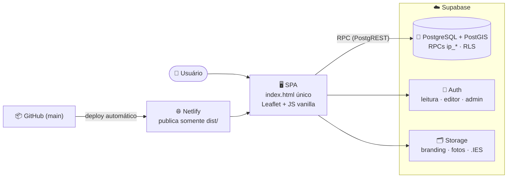

<div align="center">

# 💡 Iluminação LED Niterói

### Dashboard de Modernização do Parque Luminotécnico

**Sistema georreferenciado de gestão da infraestrutura de iluminação pública de Niterói/RJ** —
mapa interativo, edição em campo, indicadores de modernização LED e auditoria completa.

<br/>

[](https://app.netlify.com/projects/iluminacao-niteroi)
[](https://github.com/DaniloSFValim/iluminacao-led-niteroi/actions/workflows/e2e-tests.yml)
[](https://github.com/DaniloSFValim/iluminacao-led-niteroi/actions/workflows/api-testing.yml)
[](https://github.com/DaniloSFValim/iluminacao-led-niteroi/actions/workflows/lighthouse-ci.yml)
[](https://github.com/DaniloSFValim/iluminacao-led-niteroi/actions/workflows/security-scan.yml)


[](https://doi.org/10.5281/zenodo.21305310)
[](LICENSE)
[](https://www.conventionalcommits.org)
[](CONTRIBUTING.md)

<br/>

**[🌐 Ver Demo](https://iluminacao-niteroi.netlify.app)** ·
**[🐛 Reportar Bug](https://github.com/DaniloSFValim/iluminacao-led-niteroi/issues/new?template=bug.md)** ·
**[✨ Sugerir Feature](https://github.com/DaniloSFValim/iluminacao-led-niteroi/issues/new?template=feature.md)**

</div>

---

## 📌 Sobre o Projeto

Ferramenta da **SECONSER · Diretoria de Iluminação Pública · Prefeitura de Niterói** para
acompanhar a modernização do parque de iluminação da cidade: cada luminária, poste e caixa de
comando georreferenciados, com histórico de intervenções e indicadores em tempo real.

<div align="center">

| 🔦 Pontos mapeados | 🏘️ Bairros | ✅ Modernizados LED | 📋 Histórico de alterações |
|:---:|:---:|:---:|:---:|
| **42.763** | **52** | **39%** | **85.000+ registros** |

</div>

## ✨ Funcionalidades

<table>
<tr>
<td width="50%" valign="top">

### 🗺️ Mapa Inteligente
- Clustering dinâmico por zoom (grid geohash)
- 4 mapas-base (escuro, claro, ruas, satélite)
- Coroplético por bairro e grid de densidade
- 🔥 **Heat maps**: % LED, densidade e idade
- ✏️ **Seleção por área** (polígono): contagem, densidade, % LED e export só da região (PostGIS)

</td>
<td width="50%" valign="top">

### 🎯 Filtros Avançados
- Bairro, tipo de lâmpada, potência, status
- Faixas de % LED e watts (min/max)
- 📅 Timeline por período de modernização
- Saúde do ponto (verde/amarelo/vermelho)

</td>
</tr>
<tr>
<td width="50%" valign="top">

### ✏️ Gestão em Campo
- Cadastro de ativos direto no mapa
- Luminárias, postes, caixas, relés e braços
- Edição com fila de aprovação opcional
- 📸 Upload de foto com compressão automática

</td>
<td width="50%" valign="top">

### 📊 Dados & Conformidade
- Exportação CSV, GeoJSON e PDF
- Catálogo de modelos com **fotometria Tier 2** (lumens, lm/W, FP, THD, IK, DPS, arquivo .IES)
- Histórico completo de alterações por ponto
- Auditoria de intervenções

</td>
</tr>
</table>

## 🔐 Perfis de Acesso

| Papel | Visualizar | Criar/Editar pontos | Excluir | Administração |
|-------|:---:|:---:|:---:|:---:|
| 👁️ `leitura` | ✅ | — | — | — |
| ✏️ `editor` | ✅ | ✅ | — | Modelos |
| 🛡️ `admin` | ✅ | ✅ | ✅ | Usuários, branding, aprovações |

> O mapa é **público** (sem login). Escrita exige autenticação + papel — validado por RLS
> e por RPCs `SECURITY DEFINER` com verificação de papel no banco, nunca no cliente.

## 🏗️ Arquitetura



**Decisões de projeto:** zero build step, zero framework — um único `index.html` autocontido
com dependências via CDN. Toda a lógica de permissão vive no banco (RLS + RPCs).

## 📐 Fotometria de Instalação (Tier 3)

> **Do inventário ao modelo de engenharia.** Além de registrar *o que* está instalado, o
> sistema captura **como** e **onde** — transformando o cadastro em base para análise
> luminotécnica e **objeto de artigo científico**.

Cada luminária pode ser classificada por dois parâmetros de instalação, coletados em
**opções pré-definidas** (sem digitação livre) e convertidos em índices exibidos no painel:

| Parâmetro | Captura | Alimenta |
|---|---|---|
| 📐 **Ângulo de apontamento** (0°–120°, nadir) | dropdown pré-classificado | Aproveitamento no piso · *uplight* |
| 🧱 **Material do piso** (asfalto, concreto, água…) | dropdown com refletância ρ tabelada | Luminância percebida · luz refletida ao céu |

A partir deles, três indicadores de primeira ordem são calculados e mostrados por ponto:

<div align="center">

| Indicador | Fórmula | Significado |
|---|:---:|---|
| **Aproveitamento no piso** | `η = max(0, cos θ)` | fração do fluxo útil no solo |
| **Poluição luminosa** | `P = (1−η) + ρ·η·0,5` | *skyglow* direto + refletido |
| **Luminância relativa** | `L = η·ρ` | o que o olho percebe |

</div>

📖 **Modelo completo, fórmulas, refletâncias e referências normativas (ABNT NBR 5101, CIE
144/150, IESNA BUG):** [`docs/FIELD_REFERENCE_TIER3_PHOTOMETRY.md`](docs/FIELD_REFERENCE_TIER3_PHOTOMETRY.md)

## 🚀 Começando

### Pré-requisitos

- Qualquer servidor HTTP estático (ou só abrir o arquivo no navegador)
- Node.js 18+ apenas para rodar os testes

### Rodando localmente

```bash
# 1. Clone o repositório
git clone https://github.com/DaniloSFValim/iluminacao-led-niteroi.git
cd iluminacao-led-niteroi

# 2. Sirva o index.html
npx http-server .
# → http://localhost:8080
```

> 💡 O app aponta para o Supabase de produção via chave *publishable* (pública por design).
> Para um backend próprio, veja [`supabase/README.md`](supabase/README.md) e [`.env.example`](.env.example).

### Rodando os testes

```bash
npm install
npx playwright test        # E2E (26 testes)
```

## 🧪 Qualidade & CI/CD

| Workflow | O que faz | Quando roda |
|----------|-----------|-------------|
| ⚙️ **CI** | Validação de HTML e migrations | push / PR |
| 🎭 **E2E Tests** | 26 testes Playwright contra o deploy preview | PR |
| 🔌 **API Tests** | 9 requisições Newman/Postman contra os RPCs | PR |
| 🔦 **Lighthouse CI** | Auditoria de performance | PR |
| 🛡️ **Security Scan** | npm audit + análise estática | push / PR |
| 💾 **Backup** | Dump diário do banco | cron 02:00 UTC |

## 🗄️ Banco de Dados

O schema é versionado em [`supabase/migrations/`](supabase/migrations/) — **leia o
[README de migrations](supabase/migrations/README.md)** antes de qualquer mudança:
o banco de produção é a fonte de verdade e *merge de PR não aplica migration*.

<details>
<summary><b>📂 Estrutura do projeto</b></summary>

```
iluminacao-led-niteroi/
├── index.html                  # 🎯 A aplicação inteira (SPA autocontida)
├── netlify.toml                # Deploy: publica somente dist/index.html
├── supabase/
│   ├── migrations/             # Schema versionado (espelho do banco) + README
│   └── migrations_archive/     # Migrations legadas (NÃO executar)
├── tests/                      # E2E Playwright
├── scripts/                    # Backup & restore
├── docs/                       # Referência de campos Tier 2
├── .github/workflows/          # 7 pipelines de CI/CD
├── ARCHITECTURE.md             # Arquitetura detalhada
├── DEPLOYMENT_GUIDE.md         # Guia de deploy passo a passo
├── TROUBLESHOOTING.md          # Soluções para problemas comuns
└── CHANGELOG.md                # Histórico de versões
```

</details>

## 🗺️ Roadmap

- [x] Mapa com clustering, heat maps e timeline
- [x] CRUD de pontos com papéis e fila de aprovação
- [x] Catálogo de modelos com fotometria Tier 2 (lumens, FP, THD, IK, DPS, .IES)
- [x] Compressão automática de fotos no upload
- [x] CI/CD completo (E2E, API, Lighthouse, security scan)
- [x] Tier 3 (Fase 1+2) — Fotometria de instalação: ângulo de apontamento + material do piso com índices de aproveitamento e poluição luminosa
- [ ] Tier 1 — Conformidade regulatória (registro INMETRO, vida útil, garantia)
- [ ] Tier 3 (Fase 3) — Curva .IES + espalhamento atmosférico (PM2.5) e calibração em lux
- [ ] Galeria com múltiplas fotos por ativo
- [ ] PWA / modo offline para equipes de campo

Veja as [issues abertas](https://github.com/DaniloSFValim/iluminacao-led-niteroi/issues) para a lista completa.

## 🤝 Contribuindo

Contribuições são bem-vindas! Leia o [guia de contribuição](CONTRIBUTING.md) e o
[código de conduta](CODE_OF_CONDUCT.md). Em resumo:

1. Faça um fork e crie sua branch: `git checkout -b feature/minha-feature`
2. Commit seguindo [Conventional Commits](https://www.conventionalcommits.org): `feat: adicionar X`
3. Abra um PR — os templates de [bug](.github/ISSUE_TEMPLATE/bug.md) e
   [feature](.github/ISSUE_TEMPLATE/feature.md) ajudam a padronizar

Vulnerabilidades de segurança: siga a [política de segurança](SECURITY.md) — **não** abra issue pública.

## 📚 Documentação

| Documento | Conteúdo |
|-----------|----------|
| [ARCHITECTURE.md](ARCHITECTURE.md) | Diagramas, fluxos e modelo de dados |
| [DEPLOYMENT_GUIDE.md](DEPLOYMENT_GUIDE.md) | Deploy do zero (Netlify + Supabase) |
| [TROUBLESHOOTING.md](TROUBLESHOOTING.md) | FAQ e diagnóstico de problemas |
| [APPROVAL_WORKFLOW.md](APPROVAL_WORKFLOW.md) | Fila de aprovação de alterações |
| [docs/FIELD_REFERENCE_TIER2.md](docs/FIELD_REFERENCE_TIER2.md) | Campos de fotometria e conformidade do modelo (Tier 2) |
| [docs/FIELD_REFERENCE_TIER3_PHOTOMETRY.md](docs/FIELD_REFERENCE_TIER3_PHOTOMETRY.md) | 📐 Fotometria de instalação: ângulo, material do piso e índices de poluição luminosa (Tier 3) |
| [paper/](paper/) | 📄 Rascunho de artigo científico (PT + EN), dados e figuras reprodutíveis |
| [docs/INTELLECTUAL_PROPERTY.md](docs/INTELLECTUAL_PROPERTY.md) | 🔒 Propriedade intelectual: DOI Zenodo, registro INPI, como citar |
| [CHANGELOG.md](CHANGELOG.md) | Histórico de versões |

## 📝 Como citar

**Autor:** Danilo Valim — ORCID [`0009-0009-7250-6151`](https://orcid.org/0009-0009-7250-6151)
· **DOI:** [`10.5281/zenodo.21305310`](https://doi.org/10.5281/zenodo.21305310)

Se você usar este software ou o método de índices fotométricos, cite:

> Valim, D. (2026). *Iluminação LED Niterói — sistema georreferenciado de gestão do
> parque de iluminação pública com índices fotométricos de instalação* (v1.3.0)
> [Software]. Zenodo. https://doi.org/10.5281/zenodo.21305310

O GitHub também gera a citação a partir do [`CITATION.cff`](CITATION.cff) (botão
*"Cite this repository"*, com o iD do ORCID e o DOI).

## 📄 Licença

Distribuído sob a licença MIT. Veja [`LICENSE`](LICENSE) para mais informações.

---

<div align="center">

**Desenvolvido por [Danilo Valim](https://github.com/DaniloSFValim)**

SECONSER · Diretoria de Iluminação Pública · Prefeitura de Niterói

Feito com 💛 para iluminar Niterói

⭐ Se este projeto te ajudou, deixe uma estrela!

</div>
