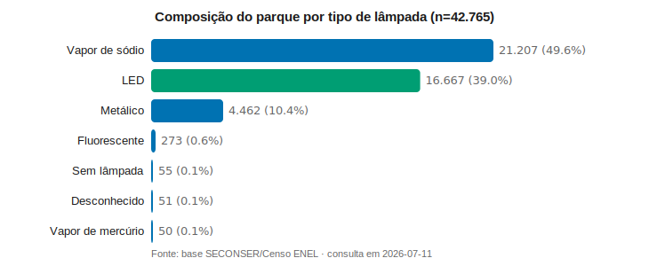
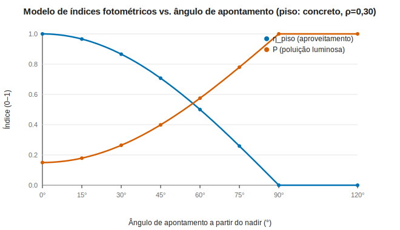
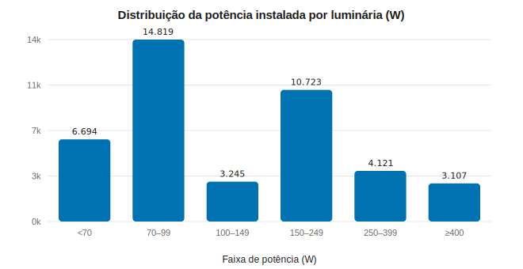
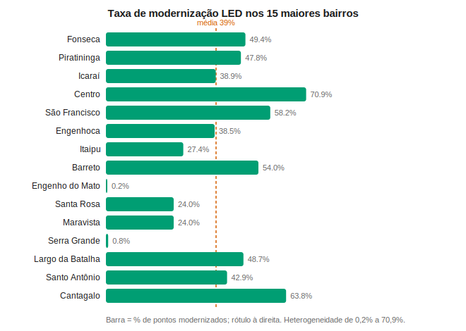

# Gestão georreferenciada do parque de iluminação pública com índices fotométricos de instalação de primeira ordem: o caso de Niterói/RJ

**Danilo Valim**
Pesquisador Independente
`danilosfvalim@gmail.com`

> **Status:** rascunho (draft) para submissão. Números do parque consultados em
> produção em 2026-07-11. Código e dados: ver *Disponibilidade* ao final.

---

## Resumo

A modernização para LED e o controle da poluição luminosa exigem, além de um
inventário do que está instalado, o registro de **como** e **onde** cada luminária
opera. Este trabalho apresenta um sistema web georreferenciado de gestão do parque
de iluminação pública em contexto urbano (**42.765 pontos, 52 bairros, 39% já em
LED, ~5,8 MW instalados**) e propõe um **método de índices fotométricos de
instalação de primeira ordem** que combina dois atributos de campo de baixo custo —
o **ângulo de apontamento** do facho e o **material do piso** (refletância) —
coletados por opções pré-classificadas. Desses atributos derivam-se, por ponto e
por área, três indicadores comparáveis: **aproveitamento no piso** (η), **poluição
luminosa** (P) e **luminância relativa** (L). O sistema inclui ainda **análise
espacial por seleção de polígono** sobre PostGIS, permitindo agregar contagem,
densidade, taxa de LED e os índices para qualquer região arbitrária. Discutem-se as
premissas explícitas do modelo, seus limites e o caminho para calibração radiométrica
(curva .IES e espalhamento atmosférico). Todo o código, o esquema de banco e a
documentação do modelo são abertos e versionados, com dados de reprodução
disponibilizados.

**Palavras-chave:** iluminação pública; modernização LED; poluição luminosa;
fotometria; refletância de pavimento; SIG; PostGIS; cidades inteligentes.

---

## 1. Introdução

A iluminação pública é um dos maiores itens de consumo elétrico municipal e um vetor
direto de segurança, mobilidade e qualidade do ambiente noturno. A substituição de
lâmpadas de descarga (vapor de sódio, metálico) por LED promete eficiência, mas
introduz riscos de **ofuscamento** e **poluição luminosa** quando a instalação não é
adequada. A gestão desse parque, historicamente, apoia-se em inventários que
registram o *equipamento* (potência, tipo de lâmpada) mas raramente a *condição de
instalação* — ângulo, entorno, superfície iluminada —, justamente as variáveis que
determinam quanto do fluxo é útil e quanto escapa para o céu.

Este artigo relata o desenvolvimento e a operação de um sistema georreferenciado
em contexto de parque de iluminação pública urbana e propõe um método leve para
capturar e quantificar a condição de instalação em escala. As **contribuições** são:

1. Um **sistema aberto e reprodutível** de gestão do parque (mapa, cadastro em campo,
   auditoria, indicadores), sobre uma pilha sem *build* (SPA + PostGIS + deploy
   contínuo), documentado e versionado.
2. Um **método de índices fotométricos de instalação de primeira ordem** a partir de
   dois atributos pré-classificados (ângulo de apontamento e material do piso), com
   premissas explícitas e enquadramento normativo.
3. Uma camada de **análise espacial por polígono** que restringe estatísticas e
   exportação a qualquer área desenhada, viabilizando diagnósticos por região.

## 2. Fundamentação e trabalhos relacionados

O dimensionamento viário no Brasil é regido pela **ABNT NBR 5101**, que trata de
iluminância/luminância de projeto e uniformidade, incorporando a **refletância do
pavimento** por meio de classes de superfície (base das tabelas R da **CIE 144**). A
limitação da luz intrusiva e do brilho do céu é orientada pela **CIE 150**, que
define razões como a *Upward Light Ratio* (ULR). A classificação **BUG**
(*Backlight–Uplight–Glare*, IESNA TM-15) resume, por luminária, o quanto de fluxo vai
para trás, para cima e como ofuscamento. Esses instrumentos são precisos, porém
demandam a curva fotométrica completa (arquivo .IES) e cálculo ponto a ponto —
inviável de aplicar diretamente a dezenas de milhares de instalações herdadas sem
levantamento fotométrico individual.

A lacuna que este trabalho endereça é **operacional**: como capturar, em escala e a
baixo custo, informação de instalação suficiente para *ordenar* e *priorizar* o
parque quanto a aproveitamento e poluição — antes e independentemente de uma
simulação radiométrica completa.

## 3. Materiais e Métodos

### 3.1 Arquitetura do sistema

A aplicação é uma *single-page application* autocontida (HTML/JS sem framework,
Leaflet para o mapa), servida estaticamente (Netlify) e apoiada no **Supabase**
(PostgreSQL + PostGIS, autenticação por papéis e *storage*). Toda a lógica de
autorização vive no banco (RLS + funções `SECURITY DEFINER`), e o esquema é
versionado por *migrations*. Não há etapa de *build*, o que reduz a superfície de
manutenção e favorece a reprodutibilidade.

### 3.2 Modelo de dados e caracterização do parque

Cada ponto (`pontos_luminaria`) guarda geometria (`geom`, SRID 4326), tipo de ativo,
tipo e potência de lâmpada, estado de modernização e proveniência do dado. O parque
estudado como caso de aplicação contém **42.765 luminárias** em **52 bairros**, das
quais **16.667 (39,0%)** já modernizadas para LED, totalizando **~5.825 kW**
instalados. A Figura 1 mostra a composição por tipo de lâmpada e a Figura 4, a
distribuição de potência.

**Figura 1.** Composição do parque por tipo de lâmpada (n=42.765). O vapor de sódio
ainda predomina (49,6%), seguido pelo LED (39,0%).

### 3.3 Índices fotométricos de instalação

Dois atributos são coletados por **opções pré-classificadas** (sem digitação livre,
garantindo integridade e comparabilidade):

- **Ângulo de apontamento** θ, medido a partir da **vertical descendente (nadir)**:
  0° = facho reto para baixo (*full-cutoff*, ideal); 90° = horizontal; 120° = *uplight*.
  Opções: {0, 15, 30, 45, 60, 75, 90, 120}°.
- **Material do piso**, associado a uma **refletância difusa média** ρ tabelada
  (Tabela 1).

**Tabela 1.** Refletância difusa média por material (fontes: CIE 144, CIE 30.2,
IESNA, ABNT NBR 5101).

| Material | ρ | Material | ρ |
|---|:--:|---|:--:|
| Asfalto novo (escuro) | 0,07 | Terra batida | 0,20 |
| Asfalto desgastado | 0,12 | Vegetação/grama | 0,08 |
| Concreto/cimento | 0,30 | Areia | 0,25 |
| Paralelepípedo/pedra | 0,18 | Água | 0,06 |

Sob premissas explícitas de primeira ordem — feixe representado pelo eixo óptico,
reflexão Lambertiana do piso com fração f_up = 0,5 retornando ao hemisfério superior,
plano de trabalho horizontal — definem-se:

- **Aproveitamento geométrico no piso:** η = max(0, cos θ)
- **Luminância relativa da superfície:** L = η · ρ
- **Índice de poluição luminosa (proxy 0–1):** P = min(1, (1 − η) + ρ · η · f_up)

O primeiro termo de P representa a fração do fluxo que **não** incide no piso
(perdida lateralmente/para cima como ofuscamento e brilho direto); o segundo, a
parcela **refletida** de volta ao céu — de modo que superfícies mais claras
(concreto, areia) elevam a poluição refletida, ao passo que melhoram a percepção
(L). A Figura 3 ilustra o comportamento monotônico de η e P com θ.

**Figura 3.** Índices em função do ângulo (piso de concreto, ρ=0,30). η decresce de
1 (nadir) a 0 (horizontal); P cresce de forma complementar, com cruzamento em torno
de 57°.

### 3.4 Análise espacial por polígono

Duas funções PostGIS (`ip_pontos_poligono`, `ip_stats_poligono`) recebem um polígono
GeoJSON e, via prefiltro por *bounding box* (índice GIST) seguido de `ST_Contains`,
retornam os pontos e as estatísticas **restritos à área**: total, área (km²),
densidade (pontos/km²), taxa de LED, potência instalada, composição por tipo e a
média dos índices fotométricos. Isso viabiliza diagnóstico e exportação por qualquer
região arbitrária, não apenas por bairro ou pela janela do mapa.

### 3.5 Reprodutibilidade

O esquema é versionado por *migrations* espelhadas no repositório; pipelines de CI
executam testes de API (Newman), E2E (Playwright), auditoria de performance
(Lighthouse) e varredura de segurança. Os números deste artigo constam em
`paper/data/parque_stats_2026-07-11.csv`, e as figuras são geradas por script
determinístico (`paper/figures/gen_figures.py`).

## 4. Resultados

### 4.1 Caracterização e heterogeneidade

O parque combina uma base ainda majoritariamente de descarga (vapor de sódio 49,6%,
metálico 10,4%) com 39,0% de LED (Figura 1). A distribuição de potência (Figura 4)
concentra-se nas faixas 70–99 W (14.819) e 150–249 W (10.723), refletindo a
coexistência de LED viário moderno e luminárias de sódio de maior carga.

**Figura 4.** Distribuição da potência instalada por luminária.

A modernização é **espacialmente heterogênea** (Figura 2): entre os quinze maiores
bairros, a taxa de LED varia de 0,2% (Engenho do Mato) e 0,8% (Serra Grande) a 70,9%
(Centro) e 63,8% (Cantagalo), contra a média de 39% do parque. Essa dispersão indica
frentes de modernização concentradas e regiões periféricas ainda pendentes.

**Figura 2.** Taxa de LED nos 15 maiores bairros; linha tracejada = média do parque
(39%).

### 4.2 Comportamento do modelo

O modelo (Figura 3) reproduz a física qualitativa esperada: o aproveitamento é máximo
no apontamento a nadir e nulo na horizontal; a poluição cresce de forma monotônica
com a inclinação e é ampliada por materiais de maior refletância. Para concreto
(ρ=0,30), P varia de 0,15 (nadir) a 1,0 (horizontal/uplight); para asfalto novo
(ρ=0,07), P a nadir cai para 0,035 — evidenciando o *trade-off* entre percepção
(materiais claros ajudam L) e poluição refletida.

### 4.3 Exemplo de análise por área

Uma seleção poligonal sobre a região Centro/Icaraí (~10,2 km²) retornou 6.497
luminárias, densidade de 635 pontos/km², 57,5% de LED e 1.209 kW instalados — em
segundos, sobre o índice espacial. O mesmo recurso restringe a exportação (CSV/GeoJSON)
à área, apoiando estudos localizados.

## 5. Discussão

O método é, deliberadamente, um **proxy geométrico de primeira ordem**: assume feixe
estreito, reflexão puramente difusa e atmosfera transparente. Não substitui simulação
radiométrica nem dispensa a NBR 5101 para projeto. Seu valor está em **ordenar e
priorizar** um parque grande com dado barato e comparável — por exemplo, sinalizando
instalações de apontamento elevado (alta P) para inspeção, ou estimando o efeito de
trocar o entorno/geometria antes de um levantamento fotométrico completo. As
premissas são declaradas justamente para que os índices sejam interpretados como
*indicadores relativos*, não como grandezas absolutas (lux, cd/m²).

Uma limitação relevante é a **água**, cuja reflexão especular em ângulos rasantes é
subestimada pelo modelo difuso. Outra é a dependência da qualidade da classificação
de campo; por isso a coleta é feita por opções fechadas e validada por restrições no
banco (`CHECK` no ângulo, chave estrangeira no material).

## 6. Conclusão e trabalhos futuros

Apresentou-se um sistema aberto de gestão do parque de iluminação de Niterói e um
método leve para quantificar a condição de instalação, integrando dados de
inventário, indicadores fotométricos de primeira ordem e análise espacial por área.
Os próximos passos (Fase 3) são: (i) integrar a **curva fotométrica .IES** já
armazenada no catálogo de modelos; (ii) modelar a reflexão **especular** para lâminas
d'água; (iii) incorporar o **espalhamento atmosférico por partículas (PM2.5)** a
partir de séries de qualidade do ar, corrigindo a eficácia útil e o brilho do céu; e
(iv) **calibrar** os índices para grandezas absolutas (lux, ULR) conforme a CIE 150.

## Disponibilidade de dados e código

Código-fonte, *migrations* e documentação do modelo:
<https://github.com/DaniloSFValim/openlux> (licença MIT). Dados de
reprodução em `paper/data/`. Após arquivamento, citar pelo DOI do Zenodo (ver
`docs/INTELLECTUAL_PROPERTY.md`).

## Referências

Ver `paper/references.bib`.
